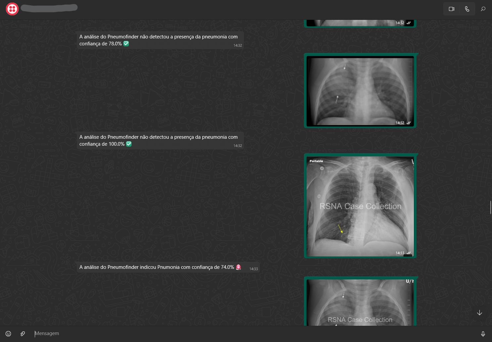

# 🫁 PneumoFinder API RESTful

          

---

O **PneumoFinder** é uma API RESTful desenvolvida em **Flask** que utiliza **Redes Neurais Convolucionais (CNNs)** e **Modelos de Linguagem Multimodais (LLMs)** para análise de radiografias de pulmão.  
A aplicação é capaz de:

- Detectar sinais de **pneumonia** em radiografias de tórax com CNN baseada em ResNet50  
- Fornecer diagnósticos com nível de confiança e persistência em banco de dados  
- Gerar **descrições clínicas explicativas** usando LLaVA (Large Language and Vision Assistant)  
- Produzir **visualizações Grad-CAM** (heatmaps e overlays) das regiões de atenção do modelo  
- **Busca semântica** de diagnósticos similares usando embeddings vetoriais (ChromaDB)  
- Integrar-se ao **WhatsApp** via Twilio, permitindo que o usuário envie a radiografia e receba o diagnóstico diretamente no aplicativo de mensagens  

---

## 📌 Funcionalidades

### Endpoints Principais de Diagnóstico
- **`POST /diagnose`** → Diagnóstico de pneumonia com CNN (retorna JSON com diagnosis_id, diagnosis, confidence)  
- **`POST /diagnose/explained`** → Diagnóstico completo com Grad-CAM + descrição clínica do LLM + visualizações  
- **`GET /health`** → Health check da API  

### Endpoints de Banco de Dados
- **`GET /api/diagnoses/<id>`** → Recupera diagnóstico completo por ID (inclui heatmap/overlay em base64)  
- **`POST /api/search/similar`** → Busca semântica de diagnósticos similares usando embeddings  
- **`GET /api/diagnoses/recent`** → Lista diagnósticos recentes (padrão: 10)  

### Endpoints Legados (Compatibilidade)
Os seguintes endpoints em português redirecionam para os endpoints principais:
- **`POST /diagnosticar_pneumonia`** → Redireciona para `/diagnose`  
- **`POST /diagnostico_completo`** → Redireciona para `/diagnose`  
- **`POST /diagnosticar_com_descricao`** → Redireciona para `/diagnose/explained`  

### Integração WhatsApp
- **`POST /webhook`** → Endpoint webhook do Twilio para receber mensagens e imagens via WhatsApp  

---

## 🛠️ Tecnologias Utilizadas

- **Python 3.11** (gerenciado via [mise](https://mise.jdx.dev/))  
- **Flask** - Framework web para API REST  
- **Flask-CORS** - Habilita requisições entre origens  
- **TensorFlow / Keras** - Modelos CNN (ResNet50) para classificação de imagens  
- **SQLite** - Banco de dados relacional para armazenamento de diagnósticos  
- **ChromaDB** - Banco de dados vetorial para busca semântica  
- **sentence-transformers** - Geração automática de embeddings para similaridade  
- **Ollama + LLaVA 7B** - Modelo de linguagem multimodal para descrições clínicas  
- **OpenCV (cv2)** - Geração de visualizações Grad-CAM (heatmaps e overlays)  
- **Twilio API** - Integração com WhatsApp  
- **python-dotenv** - Gerenciamento de variáveis de ambiente  
- **Pillow** - Processamento de imagens  
- **requests** - Requisições HTTP para APIs externas  
- **uv** - Gerenciador de pacotes Python ultrarrápido  

---

## 📂 Estrutura do Projeto

```
PneumoFinder/
│── models/                  # Modelo treinado (.keras)
│   └── pneumonia_model.keras
│
│── src/                     # Código-fonte refatorado (arquitetura funcional)
│   ├── api/
│   │   └── app.py           # Rotas Flask (endpoints REST)
│   ├── core/
│   │   ├── diagnosis.py     # Funções de inferência CNN
│   │   ├── visualization.py # Geração de Grad-CAM
│   │   └── clinical_description.py  # Integração com LLM
│   ├── db/
│   │   ├── database.py      # Gerenciamento de conexão SQLite
│   │   ├── repositories.py  # Operações CRUD e deduplicação
│   │   └── vector_store.py  # ChromaDB para busca semântica
│   ├── utils/
│   │   ├── config.py        # Configuração centralizada
│   │   ├── file_utils.py    # Operações de arquivos
│   │   └── image_utils.py   # Processamento de imagens
│   └── bots/
│       └── whatsapp_bot.py  # Integração com WhatsApp
│
│── database/                # Banco de dados persistente
│   ├── pneumofinder.db      # SQLite database
│   └── vectors/             # ChromaDB collection storage
│
│── docs/                    # Documentação técnica
│   ├── ARCHITECTURE.md      # Arquitetura do sistema
│   ├── DATABASE_INTEGRATION.md  # Guia de integração do banco
│   └── RESEARCH.md          # Pesquisa sobre LLM multimodal
│
│── prompts/
│   └── medical_analysis.txt # Template de prompt para LLM
│
│── temp/                    # Pasta temporária para uploads
│── data/samples/            # Imagens de exemplo (gitignored)
│── tests/                   # Testes automatizados
│
│── app.py                   # Ponto de entrada da API
│── pyproject.toml           # Dependências do projeto (gerenciado por uv)
│── .mise.toml               # Configuração do mise (Python 3.11)
│── .env.example             # Exemplo de variáveis de ambiente
│── .gitignore               # Arquivos ignorados pelo git
```

---

## ⚙️ Instalação e Configuração

### 🐳 Opção 1: Docker (Recomendado)

A maneira mais rápida de rodar o projeto com todas as dependências isoladas:

```bash
# 1. Instale Docker Desktop
# https://www.docker.com/products/docker-desktop

# 2. Instale e inicie o Ollama no host (para acesso à GPU)
curl -fsSL https://ollama.com/install.sh | sh
ollama pull llava:7b
ollama serve

# 3. Clone o repositório
git clone https://github.com/seu-usuario/pneumofinder.git
cd pneumofinder

# 4. Inicie os serviços
docker-compose up -d

# 5. Teste a API
curl http://localhost:5001/health
```

✅ **Vantagens do Docker:**
- Zero configuração de dependências Python
- ChromaDB já configurado e isolado
- Volumes persistentes para banco de dados
- Fácil deploy em servidores

📖 **Documentação completa:** [DOCKER.md](DOCKER.md)

---

### 💻 Opção 2: Instalação Local (Desenvolvimento)

### Pré-requisitos
- [mise](https://mise.jdx.dev/getting-started.html) - Gerenciador de versões de ferramentas
  ```bash
  # macOS/Linux
  curl https://mise.run | sh
  
  # Windows (PowerShell)
  irm https://mise.run | iex
  ```

- [Ollama](https://ollama.ai/) - Para rodar o modelo LLaVA localmente
  ```bash
  # macOS/Linux
  curl -fsSL https://ollama.com/install.sh | sh
  
  # Windows - baixe o instalador em https://ollama.com/download
  
  # Após instalar, baixe o modelo LLaVA:
  ollama pull llava:7b
  ```

### Instalação

1. Clone este repositório:
   ```bash
   git clone https://github.com/seu-usuario/pneumofinder.git
   cd pneumofinder
   ```

2. Configure o ambiente com mise (instala Python 3.11 e cria o virtualenv automaticamente):
   ```bash
   mise install
   ```

3. Instale as dependências com uv:
   ```bash
   mise run install
   # ou: uv sync
   ```

4. Configure as variáveis de ambiente no arquivo `.env`:
   ```env
   TWILIO_ACCOUNT_SID=seu_sid
   TWILIO_AUTH_TOKEN=seu_token
   ```

5. Inicie o servidor Ollama (em outro terminal):
   ```bash
   ollama serve
   # O servidor ficará disponível em http://localhost:11434
   ```

6. Execute a API:
   ```bash
   mise run run
   # ou: uv run python app.py
   # API estará disponível em http://localhost:5001
   ```

### Comandos Disponíveis

- `mise run install` - Instala dependências com uv sync
- `mise run run` - Executa a API Flask (porta 5001)
- `mise run lint` - Verifica código com ruff
- `mise run format` - Formata código com ruff
- `mise run format-check` - Verifica formatação sem modificar

### Migração do ambiente antigo (opcional)

Se você estava usando `venv` tradicional:
```bash
# Remove o ambiente antigo
rm -rf venv/

# mise + uv cuidam do resto
mise install
mise run install
```

---

## ✅ Exemplos de Uso

### 1. Diagnóstico Simples (cURL)

```bash
curl -X POST http://localhost:5001/diagnose \
  -F "image=@radiografia_teste.jpg"
```

Resposta esperada:
```json
{
  "diagnosis_id": 42,
  "diagnosis": "PNEUMONIA",
  "confidence": 0.8734
}
```

**Nota:** Se a mesma imagem for enviada novamente, o sistema retornará o mesmo `diagnosis_id` (deduplicação por SHA-256).

### 2. Diagnóstico Completo com Explicação (cURL)

```bash
curl -X POST http://localhost:5001/diagnose/explained \
  -F "image=@radiografia_teste.jpg"
```

Resposta esperada:
```json
{
  "diagnosis_id": 42,
  "diagnosis": "PNEUMONIA",
  "confidence": 0.8734,
  "clinical_description": "The model has identified pneumonia in this chest X-ray with 87% confidence. The areas of concern are visible in the lower right lung field, showing increased opacity consistent with consolidation. The heatmap highlights regions where the neural network detected patterns associated with bacterial pneumonia, particularly in the right lower lobe.",
  "visualizations": {
    "heatmap": "data:image/png;base64,iVBORw0KGgo...",
    "overlay": "data:image/png;base64,iVBORw0KGgo..."
  }
}
```

### 3. Buscar Diagnóstico por ID

```bash
curl http://localhost:5001/api/diagnoses/42
```

Resposta:
```json
{
  "id": 42,
  "image_hash": "a3f2b1c4d5e6f7g8h9i0j1k2l3m4n5o6p7q8r9s0t1u2v3w4x5y6z7",
  "diagnosis": "PNEUMONIA",
  "confidence": 0.8734,
  "clinical_description": "...",
  "heatmap": "data:image/png;base64,...",
  "overlay": "data:image/png;base64,...",
  "created_at": "2024-01-15T10:30:00Z"
}
```

### 4. Busca Semântica de Casos Similares

```bash
curl -X POST http://localhost:5001/api/search/similar \
  -H "Content-Type: application/json" \
  -d '{"query": "infiltrates in lower right lung field", "top_k": 5}'
```

### 5. Listar Diagnósticos Recentes

```bash
curl "http://localhost:5001/api/diagnoses/recent?limit=10"
```

---

## 📲 Imagens no WhatsApp (Chatbot)

📸 **Exemplo de envio de radiografia e resposta do bot:**  

  


---

## 📌 Observações

- O modelo espera imagens de radiografias de tórax no formato padrão (processadas para 224x224 pixels).
- As imagens são automaticamente normalizadas e pré-processadas antes da inferência.
- **Deduplicação automática:** A mesma imagem enviada múltiplas vezes não será reprocessada (usa SHA-256).
- **Visualizações:** Heatmaps e overlays são armazenados como BLOBs no banco de dados (não no filesystem).
- O projeto está configurado para ambiente local. Para produção, considere segurança, performance e escalabilidade.

---

## 🧠 Sobre os Modelos de IA

### CNN (Rede Neural Convolucional)
O modelo é uma CNN baseada em **ResNet50** treinada com o dataset Kaggle Chest X-Ray Images (Pneumonia).
- **Arquivo:** `models/pneumonia_model.keras`
- **Entrada:** Imagens 224x224 pixels (pré-processamento ResNet50)
- **Saída:** Classificação binária (NORMAL/PNEUMONIA) com score de confiança
- **Acurácia:** ~80% (em aprimoramento contínuo)
- **Limiar de decisão:** 0.5

### Grad-CAM (Visualização de Atenção)
Técnica de **explainability** que gera mapas de calor (heatmaps) mostrando quais regiões da radiografia influenciaram a decisão da CNN:
- **Heatmap:** Mapa de calor puro com gradiente vermelho (áreas críticas)
- **Overlay:** Heatmap sobreposto à radiografia original para contexto anatômico
- **Armazenamento:** BLOBs binários no banco de dados (não arquivos temporários)

### LLaVA 7B (Large Language and Vision Assistant)
Modelo multimodal de **7 bilhões de parâmetros** que combina visão computacional com linguagem natural:
- **Função:** Gera descrições clínicas explicativas em linguagem médica profissional
- **Arquitetura:** CLIP (visão) + Vicuna 7B (linguagem)
- **Execução:** Local via Ollama (sem envio de dados para APIs externas)
- **Entrada:** Radiografia original + predição CNN + visualizações Grad-CAM
- **Saída:** Narrativa clínica com localização anatômica e interpretação dos achados

### Pipeline Multimodal
```
Radiografia → CNN (ResNet50) → Predição (87% PNEUMONIA)
                    ↓
                Grad-CAM → Heatmap + Overlay
                    ↓
            LLaVA 7B (via Ollama) → Descrição clínica explicativa
                    ↓
        JSON + Armazenamento no Banco (SQLite + ChromaDB)
```

---

## 🤝 Contribuições

Contribuições são bem-vindas! Sinta-se livre para abrir issues ou enviar pull requests com melhorias, correções ou novas funcionalidades.

---

## 📄 Licença

Este projeto está sob a licença MIT. Veja o arquivo [LICENSE](LICENSE) para mais detalhes.

---


## 👨‍💻 Autor

Feito por **[Cauã Farias]**  
[LinkedIn](https://www.linkedin.com/in/cau%C3%A3-farias-739013288/) • [GitHub](https://github.com/CauZy-Goes)

## 💾 Database & Semantic Search

O PneumoFinder utiliza um sistema híbrido de armazenamento com **SQLite** (dados estruturados) e **ChromaDB** (busca vetorial).

### Funcionalidades
- ✅ **Persistência de diagnósticos** com deduplicação automática (SHA-256)
- ✅ **Busca semântica** de casos similares usando embeddings de 384 dimensões  
- ✅ **Armazenamento de visualizações** (heatmaps/overlays) como BLOBs binários no SQLite
- ✅ **Histórico completo** de diagnósticos com metadados e timestamps
- ✅ **Zero configuração** - banco inicializado automaticamente no primeiro uso

### Deduplicação Inteligente
Ao enviar a mesma imagem múltiplas vezes:
1. Calcula SHA-256 hash da imagem
2. Busca hash no banco de dados  
3. Se existir → retorna o `diagnosis_id` existente (não reprocessa)
4. Se não existir → realiza novo diagnóstico e salva

**Exemplo:**
```bash
# Primeira requisição: processa e salva (diagnosis_id: 42)
curl -X POST http://localhost:5001/diagnose -F "image=@chest_xray.jpg"

# Segunda requisição (mesma imagem): retorna diagnosis_id: 42 instantaneamente
curl -X POST http://localhost:5001/diagnose -F "image=@chest_xray.jpg"
```

### Busca Semântica com ChromaDB
```bash
# Buscar casos similares por descrição clínica
curl -X POST http://localhost:5001/api/search/similar \
  -H "Content-Type: application/json" \
  -d '{
    "query": "infiltrates in lower lung field with consolidation",
    "top_k": 5
  }'
```

**Retorna:**
```json
{
  "results": [
    {
      "id": 42,
      "diagnosis": "PNEUMONIA",
      "confidence": 0.87,
      "similarity": 0.92,
      "clinical_description": "...",
      "created_at": "2024-01-15T10:30:00Z"
    }
  ]
}
```

### Recuperar Diagnósticos Salvos
```bash
# Buscar diagnóstico específico (inclui heatmap/overlay em base64)
curl http://localhost:5001/api/diagnoses/42

# Listar diagnósticos recentes
curl "http://localhost:5001/api/diagnoses/recent?limit=10"
```

Para detalhes técnicos completos sobre a arquitetura do banco de dados, consulte `docs/DATABASE_INTEGRATION.md`.
